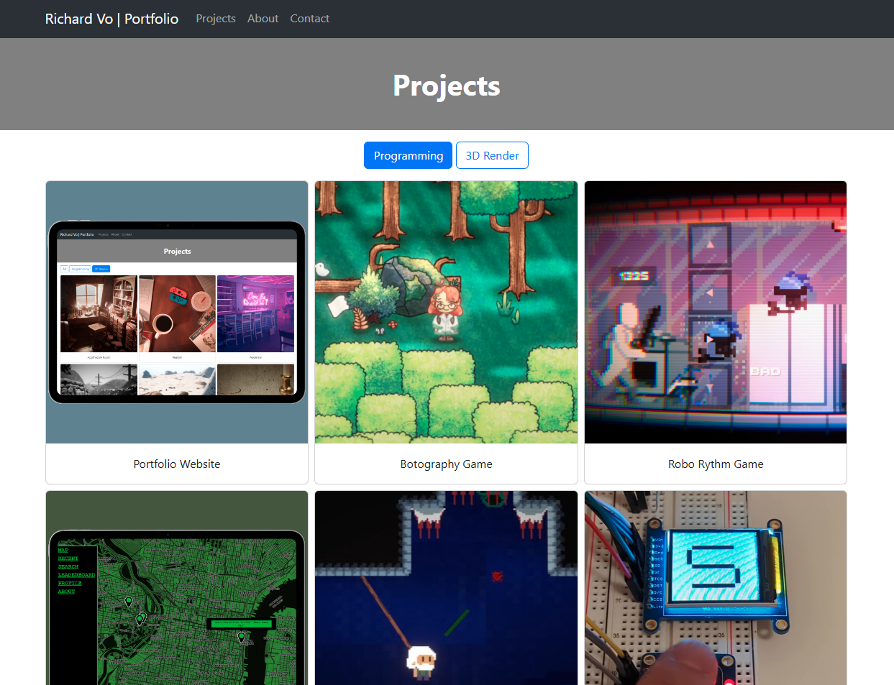
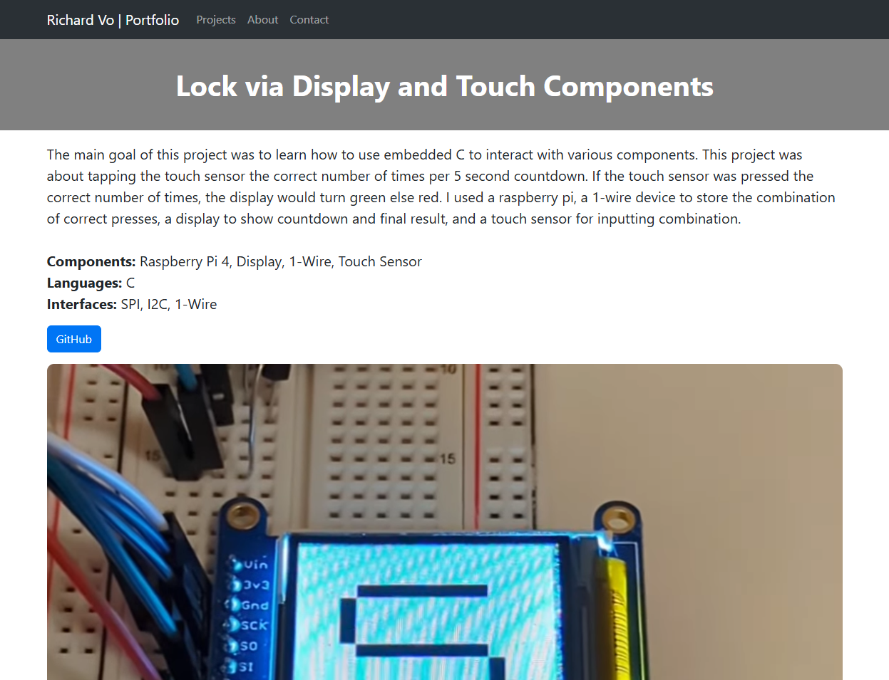
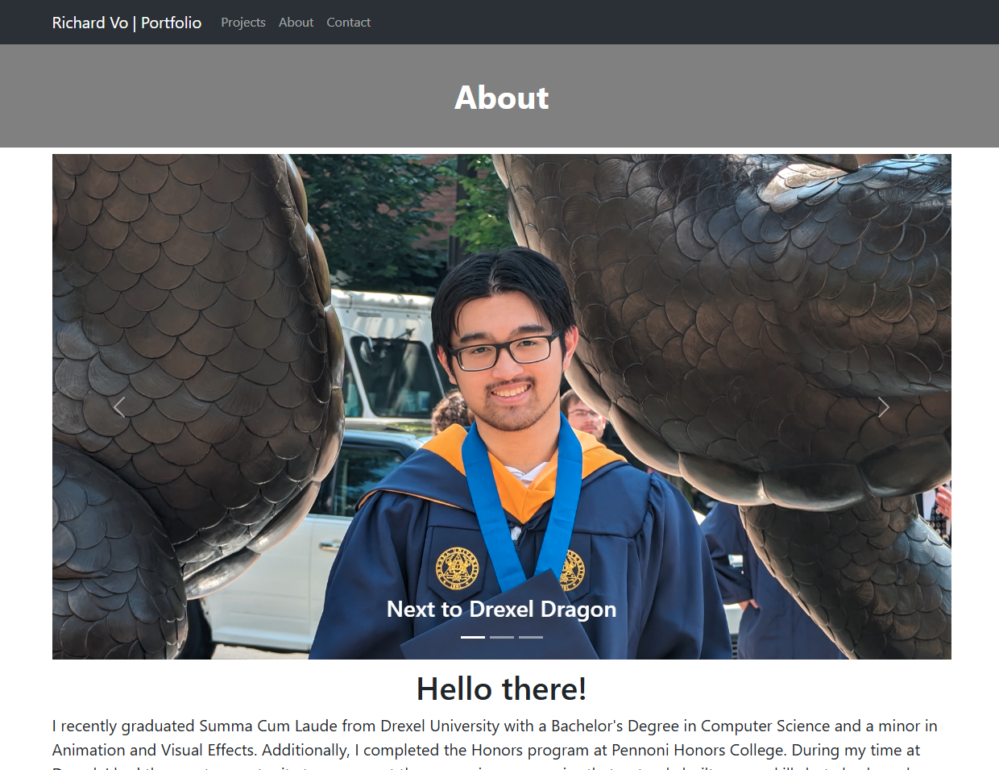
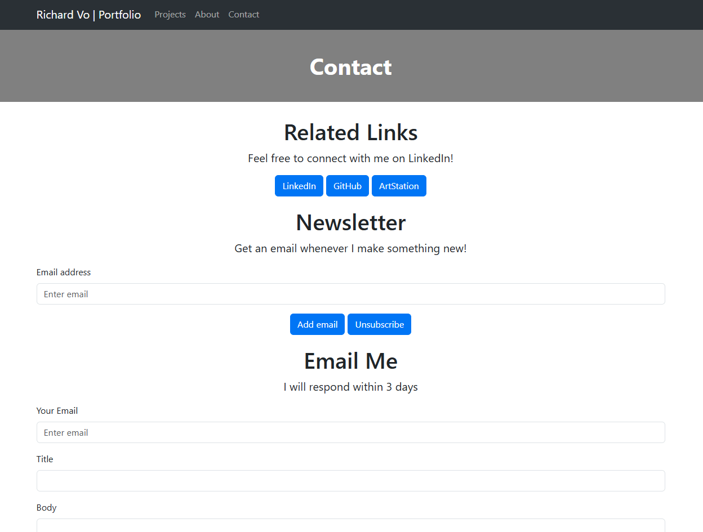

# Portfolio Website
A website where someone can view all my projects. 
This project uses React for the frontend side.
The website also features the ability for users to sign up for a newsletter and send an email to me.
Django is used for this feature side with multiple REST API endpoints.
Emails are stored in a PostgreSQL database.

# How To Run
Frontend
cd into Frontend folder
run the command 'npm run dev'

Backend
cd into Backend folder
run the command 'run manage.py runserver'

# Screenshots

# Built With
* React
* Vite
* Django
* PostgreSQL
* Amazon Web Services

# Authors
* Richard Vo
